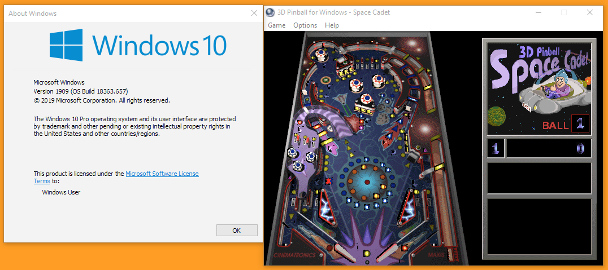

Microsoft Pinball is a term used to describe [3D Pinball for Windows - Space Cadet](https://en.wikipedia.org/wiki/Full_Tilt!_Pinball#3D_Pinball_for_Windows_.E2.80.93_Space_Cadet).

Microsoft Pinball was not released in later versions, due to a collision detection bug in the 64-bit version of the game that Microsoft was not able to resolve in time for the release of [Windows Vista](https://en.wikipedia.org/wiki/Windows_Vista)[^1].

[^1]:<https://web.archive.org/web/20121219183759/http://blogs.msdn.com/b/oldnewthing/archive/2012/12/18/10378851.aspx>

----

Since then, Pinball has been fixed (presumably with Windows XP 64-bit?). Pinball works like a charm on Windows 7, 8, and 10. If you want to play, simply grab the **Pinball.zip** and have fun!

* [Download](Microsoft_Pinball/Pinball.zip)