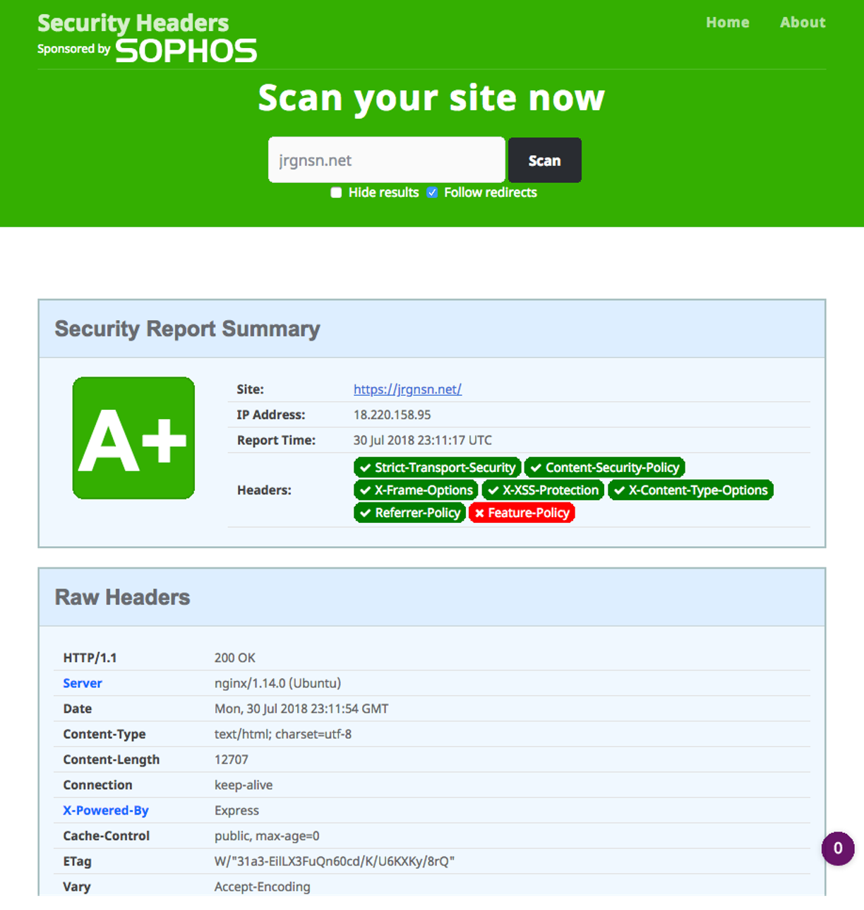

# 2018-07-30

* Modified security headers
  

# 2018-07-21

* [Aloy] Cloned matthew/fileshare.git to `/home/ubuntu/sites/content/share.jrgnsn.net/`
* [Aloy] Serving contents of above named location to share.jrgnsn.net
* [Aloy] Set up Let's Encrypt SSL cert on share.jrgnsn.net
* [AWS] Create an access key for nextcloud IAM user
* [Wario] Finally got S3 External sotrage talking
  * They want to create their own bucket, so you don't need to precreate one.
* [AWS][jrgnsnSG] opened traffic on port 5109 to all both ways for istatserver
* [aloy] installed iStat server
* [wario] installed iStat server

# 2018-07-20

* [Wario] Resized the filesystem on the EBS volute to fill the newly created space
* [AWS] Launched new EC2 instance for Graylog named "Loki"
* [Loki] Installed Elasticsearch 5.10
* [Loki] Installed MongoDB 4.0.0
* [Loki] Installed Oracle Java 8
* [Loki] Installed Graylog 2.4
* [Loki] Installed Nginx
* [Loki] Installed python-certbot-nginx

# 2018-07-18

* [Winkle] Installed redis-server
  * Enabled Redis caching for Gitea
* [AWS] Resized Wario EBS volume from 40 GB to 60 GB
* [Wario] Followed instructions to [harden Nextcloud 13](https://docs.nextcloud.com/server/13/admin_manual/configuration_server/harden_server.html):
  * [Enable HTTP Strict-Transport-Security](https://docs.nextcloud.com/server/13/admin_manual/configuration_server/harden_server.html#enable-http-strict-transport-security)
    * Set "Strict-Transport-Header" in `nc.jrgnsn.net.conf` on Wario for Nextcloud
      * "max-age=15768000; includeSubDomains;"
* [Wario] Followed Nextcloud's [Server Tuning documentation](https://docs.nextcloud.com/server/13.0.0/admin_manual/configuration_server/server_tuning.html):
  * Installed redis-server on Wario ([Nextcloud Redis Caching Config](https://docs.nextcloud.com/server/13.0.0/admin_manual/configuration_server/caching_configuration.html#id3))
    * Enabled Redis caching on Wario for Nextcloud
  * [Enabled OPcache](https://docs.nextcloud.com/server/13.0.0/admin_manual/configuration_server/server_tuning.html#enable-php-opcache)
